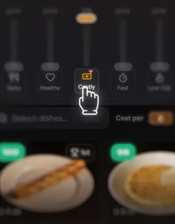

# Керуйте алгоритмом

**1. Слайдери (0–10):** задають пріоритети.
*Дешеве = 10* → застосунок високо оцінює **дешеві** страви.
*Дешеве = 0* → вимикає цей пріоритет.

**2. Тап по пріоритету:** інвертує його.
*Дешеве* → *Дороге*.
Тоді що **дорожча** страва, то **вищу** оцінку вона отримує.

**3. Економічні зони:** змінюйте регіон → розрахунок вартості відбуватиметься за місцевими цінами.

**4. Пресети:** кнопка *Зберегти* зберігає ваш топ. Пресети зберігаються локально на вашому пристрої.

<strong>Ціни в $/1000ккал?</strong>

Застосунок пропонує 3 метрики ціни: `$/кг`, `$/порція` і `$/1000ккал`. Навіщо всі три?

Порівнювати ціну двох страв за порцію складно — порції дуже різні за розміром.

Порівнювати за кг теж не завжди практично. Уявіть: літр чаю коштує копійки, при цьому буде смачним і швидким. У перерахунку на кг чай — найкраща «страва». Єдиний мінус чаю — у ньому приблизно 0 калорій.

Тому ціну часто зручніше дивитися в перерахунку на калорії.
Для цього в застосунку є 3 різні метрики (і чаю тут узагалі немає!).

